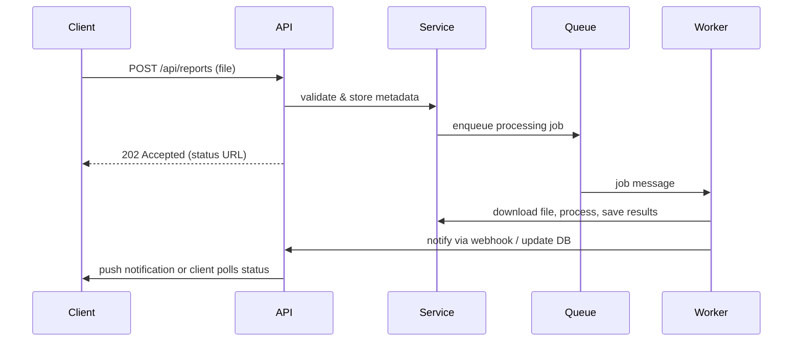

**Logic Design — System Architecture & Flows**

Overview
- Purpose: describe runtime responsibilities, component interactions, API surfaces, data flows, and background processing for the Ayubot project.
- Audience: backend engineers, integrators, and reviewers implementing or extending system behavior.

Actors
- Patient: uploads reports, creates consultations, views dashboards, requests appointments.
- Doctor: reviews reports, accepts appointments, views patient profiles, receives shared reports.
- Admin: manages users, assignments, and moderation.
- System (Background): processes datasets/reports, runs AI jobs, sends notifications.

Core Components (runtime)
- Controllers: HTTP endpoints that validate requests and map to services (e.g., `AuthController`, `MedicalReportController`, `AppointmentController`, `ConsultationController`).
- Services: business logic layer handling transactions, orchestration, validation, and calls to repositories and external APIs.
- Repositories: JPA repositories persisting domain models to the database.
- Processing Workers: asynchronous jobs for heavy tasks (file parsing, AI analysis, report export) executed by a job runner (e.g., Spring @Async, scheduled tasks, or a queue worker).
- File Storage: persistent storage for uploaded files (local or cloud). Access mediated by presigned URLs or secure endpoints.
- Notification Service: sends email/in-app notifications and retries on failure.
- External Integrations: AI/ML APIs, email/SMS gateways, cloud storage clients.

High-level Data Flow
1. Client → Controller: user sends request (multipart upload, JSON payload). Controller authenticates and validates input.
2. Controller → Service: controller delegates to service layer for business rules.
3. Service → Repository: service uses repository to persist metadata (entities like `MedicalReport`, `Consultation`, `Appointment`).
4. Service → File Storage: storing large files outside DB and saving reference in entity (`file_data` or storage path).
5. Service → Background Job: for heavy processing (OCR, AI analysis, dataset parsing), service enqueues a job and returns immediate response to client.
6. Worker → DB & Notification: worker updates entity status in DB, stores results (extracted text/ai_analysis), and triggers notifications.

Authentication & Authorization Flow
- Login/Register: `AuthController` validates credentials, hashes passwords (bcrypt) on register, issues JWT or session cookie on successful login.
- Request handling: controllers check JWT/session and role. Services enforce further checks (e.g., doctors can only access assigned patients).
- Access control: endpoints annotated with role-based checks; sensitive file access checks ownership/permission.

File Upload & Report Processing Flow
1. User uploads report via `MedicalReportController` (multipart). Controller validates MIME types and size.
2. Service stores file to File Storage and saves metadata in `medical_reports` (`file_data` may keep base64 or storage path depending on storage strategy).
3. Service enqueues processing job with job id and returns `202 Accepted` with status endpoint.
4. Worker downloads file, runs OCR/extraction, calls AI analysis, and writes `extracted_text` and `ai_analysis` to DB.
5. Worker updates `created_at`/`updated_at` and emits notification to recipient(s).

Dataset Upload & Dashboard Pipeline
- Upload validation: deny unsupported extensions; minimal schema validation.
- Parsing worker converts file into normalized tabular format, runs basic cleaning (type detection, missing values), and writes intermediate representation tied to a dataset entity.
- Aggregation/visualization service produces chart-ready series and stores dashboard snapshots or caching results.
- Dashboard retrieval: frontend requests chart data by dataset/dashboard id; service returns precomputed or on-demand aggregated results.

Consultation & Appointment Flow
- Consultation creation: patient submits symptoms; `ConsultationService` persists record and optionally notifies assigned doctor.
- Doctor updates: doctor adds notes, prescriptions; consultation status updated and audit fields set.
- Appointments: `AppointmentService` checks doctor availability (simple rule or external calendar) before persisting; notifications sent for confirmations.

Report Sharing Flow
- Share request: caller (doctor or patient) calls `ReportShareController` to create a `report_shares` record with `report_id`, `doctor_id`, and `shared_by_id`.
- Permission checks: service verifies sharer has access to original report.
- Access: recipient receives notification with secure link to report; revocation can mark `report_shares` inactive.

Error Handling & Idempotency
- Controllers return structured errors (HTTP status + body with `error_code` and `message`).
- Services use transactions for DB updates; long-running workers use idempotent job keys to avoid duplicate processing.
- Retry logic for external calls with exponential backoff; persistent failures logged and sent to an operator queue.

Background Jobs & Scalability
- Jobs are queued (in-memory queue for small setups or external queue like RabbitMQ/Redis for production).
- Workers can be scaled independently to handle dataset/AI processing load.
- Use separate DB connections/pools for workers to avoid starving web threads.

Security considerations
- Hash passwords (bcrypt) and never store plaintext.
- Sanitize and validate uploads; scan files for malware if possible.
- Enforce authorization checks for file download and sharing links (signed URLs or token checks).
- Rotate and store external API keys securely (env or secret manager).

APIs (Representative Endpoints)
- `POST /api/auth/register` — register user
- `POST /api/auth/login` — login, return JWT
- `GET /api/users/{id}` — get user profile
- `PUT /api/users/{id}` — update profile
- `POST /api/reports` — upload medical report
- `GET /api/reports/{id}` — get report metadata
- `POST /api/reports/{id}/share` — share report with another user
- `POST /api/datasets` — upload dataset
- `GET /api/dashboards/{id}` — get dashboard data
- `POST /api/consultations` — create consultation
- `POST /api/appointments` — schedule appointment

Operational notes
- Logging: structured logs with correlation ids for request → job traces.
- Metrics: instrument processing times, job queue length, error rates.
- Backups: schedule DB backups and file storage snapshots.

Implementation suggestions
- Keep controllers thin and push logic to services.
- Use DTOs for API input/output to decouple persistence models from API contracts.
- Use feature flags for experimental AI features.

Optional: Mermaid sequence (example)

Next steps (I can do)
- Produce detailed endpoint list with request/response DTOs.
- Add Mermaid ER diagram showing table relationships.
- Add sequence diagrams for each major flow (upload, share, consultation).

